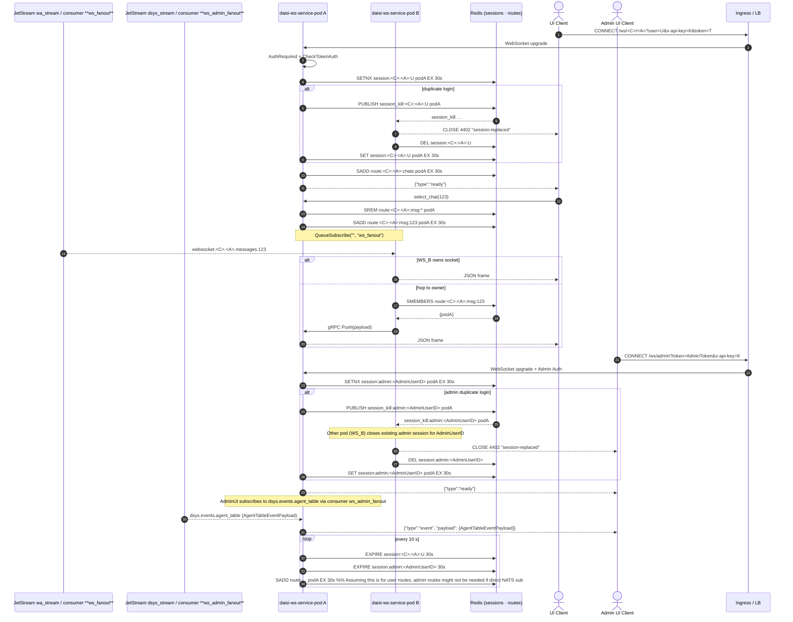
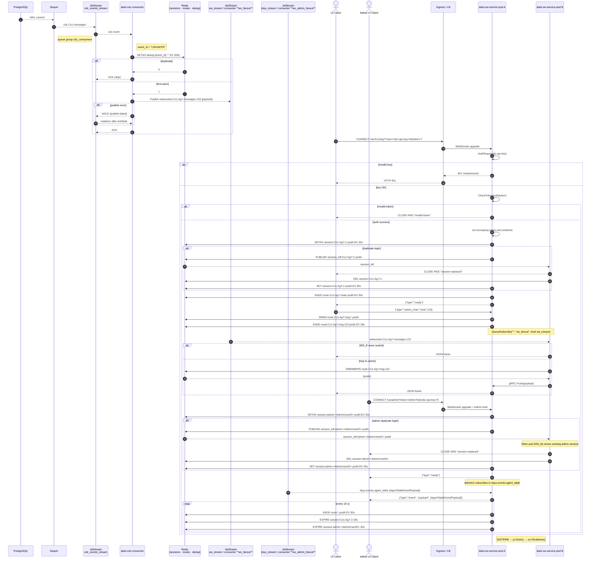

# Product Requirements Document – **daisi-ws-service**

*Document owner:* @prasetyo.pandu
*Last updated:* 19 May 2025

---

## 1 . Overview

`daisi-ws-service` is a **stateless Golang WebSocket micro-service** that broadcasts normalised WhatsApp events—published upstream by `daisi-cdc-consumer-service`—to browser operators in real time. It also provides a dedicated WebSocket endpoint for admin UI clients to stream system-level events, such as agent table modifications.
Compared with the earlier draft PRD, this version adopts the same numbered-section structure as `daisi-cdc-consumer-service`, clarifies the single-session contract for both user and admin sessions, and tightens non-functional targets.

Key capabilities:

*   **Single active session** per `(company, agent, user)` tuple for operator clients.
*   **Single active session** per `AdminUserID` for admin UI clients.
*   **Low-latency fan-out** via NATS JetStream push consumers and Redis-based route discovery for operator messages.
*   **Dedicated event stream** for admin UIs via a separate NATS subject and consumer.
*   **Horizontal scalability**—every pod is identical; Redis is the only shared state.

The service owns the browser-facing slice of the end-to-end latency budget (≤ 200 ms Sequin → browser).

---

## 2 . Core Functional Requirements

| #         | Feature                               | What it does                                                                      | How it works                                                                                                                                |
| --------- | ------------------------------------- | --------------------------------------------------------------------------------- | ------------------------------------------------------------------------------------------------------------------------------------------- |
| F-1       | **WebSocket upgrade endpoint**        | Accepts `GET /ws/<company>/<agent>?user=<U>&token=<T>&x-api-key=<K>`               | `github.com/coder/websocket v1.8.13`; sub-protocol `json.v1`                                                                              |
| F-2       | **API-key guard**                     | Blocks traffic without valid shared secret                                        | Middleware `AuthRequired` checks header/query/param against `SECRET_TOKEN`                                                                  |
| F-3       | **Company token auth**                | Ensures caller belongs to `<company>` (or is admin, if token structure allows)    | AES-GCM decrypt & compare; result cached in Redis 30 s                                                                                      |
| F-4       | **Single-tab session enforcement**    | Guarantees at most one socket per `(company, agent, user)`                        | `SETNX session:<C>:<A>:<U> <pod_id> EX 30s` + pub-sub `session_kill:<C>:<A>:<U>`                                                            |
| F-5       | **Dynamic route registry**            | Tracks which pod owns which chat/message route                                    | `SADD route:<C>:<A>:<logical>[:<chat>] <pod_id> EX 30s`                                                                                       |
| F-6       | **Automatic chat subscription**       | On connect subscribes operator to `websocket.<C>.<A>.chats`                              | JetStream `QueueSubscribe("", "ws_fanout")` bound to `wa_stream`                                                                            |
| F-7       | **Per-thread message fan-out**        | After `select_chat`, pushes only thread messages                                  | Redis route lookup; if event lands on wrong pod → gRPC hop to owner                                                                         |
| F-8       | **TTL refresh loop**                  | Keeps session & route keys alive (for both user and admin sessions)               | Every 10 s extend expiry to 30 s for `session:<C>:<A>:<U>`, `session:admin:<AdminUserID>`, and `route:*` keys.                               |
| F-9       | **Structured observability**          | Prometheus metrics, Zap JSON logs, connection-duration histogram                  | `/metrics` endpoint; Grafana dashboard later                                                                                                |
| F-10      | **Graceful drain & back-pressure**    | Drains NATS subscriptions (user & admin) before `SIGTERM`; limits JetStream lag ≤ 1 s | `Drain()` for all consumers + HPA scale on `jetstream_lag_seconds`                                                                          |
| F-ADMIN-1 | **Admin WebSocket Endpoint**          | Accepts `GET /ws/admin?token=<AdminToken>&x-api-key=<K>` for admin UI clients.    | Uses existing WebSocket library (`json.v1` sub-protocol). Requires admin-specific token validation.                                         |
| F-ADMIN-2 | **Agent Event Subscription (Admin)**  | On admin connect, subscribes to agent table events from NATS.                     | JetStream `QueueSubscribe` to `dsys.events.agent_table` (or similar) on `dsys_stream` via `ws_admin_fanout` consumer.                           |
| F-ADMIN-3 | **Admin Single-Tab Session**          | Guarantees at most one active socket per admin user.                                | `SETNX session:admin:<AdminUserID> <pod_id> EX 30s` + pub-sub `session_kill:admin:<AdminUserID>`.                                           |

---

## 3 . Subject Conventions

| Stream                        | Subscribed subject pattern                | Notes                                          |
| ----------------------------- | ----------------------------------------- | ---------------------------------------------- |
| **Chat list**                 | `websocket.<company>.<agent>.chats`              | One subject per agent                          |
| **Message thread**            | `websocket.<company>.<agent>.messages.<chat_id>` | `<chat_id>` enables selective delivery         |
| **Agent profile**             | `websocket.<company>.<agent>.agents` (future)    | Not auto-subscribed                            |
| **Agent Table Events (Admin)**| `dsys.events.agent_table`                 | For admin UI to stream agent changes (Payload: `AgentTableEventPayload`) |

> **Why** – exact 1-for-1 alignment with subjects produced by `daisi-cdc-consumer-service v3` for operator events. New `dsys.events.agent_table` for admin-specific data.

---

## 4 . Data Flow

### 4.1 Sequence diagram – happy path



---

## 5 . Technical Architecture

| Layer / Concern       | Technology / Setting                                                                                                         | Notes                                                                  |
| --------------------- | ---------------------------------------------------------------------------------------------------------------------------- | ---------------------------------------------------------------------- |
| **Language & Build**  | Go 1.23, `CGO_ENABLED=0`, multi-stage Docker (`debian:bookworm-slim`)                                                        | —                                                                      |
| **WebSocket lib**     | `github.com/coder/websocket v1.8.13` with custom ping-pong management                                                        | Context-aware & lightweight                |
| **Broker**            | NATS JetStream, streams `wa_stream` / `dsys_stream`, consumers `ws_fanout` / `ws_admin_fanout`, `DeliverPolicy=All`, `AckPolicy=Explicit` | Push mode. `dsys_stream` for admin/system events. `AckPolicy` for `ws_admin_fanout` should also be `Explicit`. |
| **Cross-pod RPC**     | gRPC over mTLS                                                                                                               | Used when event delivered to non-owner pod (primarily for user messages) |
| **Session store**     | Redis 7 single-shard, LRU, `maxmemory 200 Mi`                                                                                | Keys expire 30 s. Includes keys for admin sessions (`session:admin:<AdminUserID>`). |
| **Auth**              | API-key + AES-GCM company/admin token; secrets loaded from ENV                                                               | Admin token may require specific validation or distinct claims.        |
| **Config**            | Viper (ENV > YAML), hot reload on `SIGHUP`                                                                                   | —                                                                      |
| **Observability**     | Prometheus, Zap structured logs, optional OpenTelemetry traces                                                               | `dws_*` metrics (§ 9.1)                                                |
| **Deployment**        | Helm chart; HPA on CPU + `jetstream_lag_seconds`; PodDisruptionBudget = 1                                                    | `jetstream_lag_seconds` should consider both `ws_fanout` & `ws_admin_fanout` consumers. |
| **Graceful shutdown** | `srv.Shutdown(ctx)` + JetStream `Drain()` for all consumers                                                                  | Drains before `SIGTERM`                                                |

---

## 6 . Non-functional Requirements

| Aspect                           | Target                 |
| -------------------------------- | ---------------------- |
| Connection fan-out latency (P95) | ≤ 100 ms JS → browser  |
| End-to-end latency budget        | ≤ 200 ms CDC → browser |
| Concurrent sockets / replica     | ≥ 10 000 (combined user & admin) |
| Availability                     | ≥ 99.95 % over 30 days |
| Crash-loop budget                | ≤ 3 pod restarts/day   |

---

## 7 . Development Roadmap

| Phase                 | Deliverables                                                                         |
| --------------------- | ------------------------------------------------------------------------------------ |
| **P-0 Infra**         | Docker-compose (NATS, Redis), baseline WebSocket echo                                |
| **P-1 MVP**           | API-key & company token auth, chat-list auto-subscription, single-session enforcement |
| **P-1.5 Admin MVP**   | Admin WebSocket endpoint (`/ws/admin`), agent event subscription (`dsys.events.agent_table`), admin single-session enforcement |
| **P-2 Fan-out**       | Route registry (for user messages), per-thread message delivery, cross-pod gRPC push |
| **P-3 Observability** | Prometheus metrics, Grafana dashboard, HPA rules (covering all NATS consumers)       |
| **P-4 Resilience**    | Graceful drain (all consumers), idle-timeout, circuit breakers                       |
| **P-5 Performance**   | Load-test 10 k sockets, GC & write-buffer tuning                                     |
| **P-6 Enhancements**  | Binary protobuf frames, per-tenant QoS, multi-region replication                     |

---

## 8 . Risks & Mitigations

| Risk                             | Impact                             | Mitigation                                                                 |
| -------------------------------- | ---------------------------------- | -------------------------------------------------------------------------- |
| **Race on session lock**         | Two sockets for same user/admin    | Lua script `SETNX + PEXPIRE` atomic; integration tests for both user/admin |
| **Redis eviction**               | Session ghost → duplicate messages | 50 % headroom; alert on `redis_evicted_keys_total`                         |
| **Event delivered to wrong pod** | Extra hop adds latency             | Cluster hop < 5 ms; alert if > 20 ms                                       |
| **Token compromise**             | Unauthorised data access           | Short TTL (< 6 h), rotate AES key daily, enforce TLS                       |
| **Subject drift**                | UI misses messages                 | Contract tests in CI; shared constants module                              |

---

## 9 . Appendix

### 9.1 Custom Prometheus Metrics

| Metric name                           | Type      | Labels                                 |
| ------------------------------------- | --------- | -------------------------------------- |
| `dws_active_connections`              | Gauge     | `company` (if applicable), `agent` (if applicable), `connection_type` (user/admin) |
| `dws_session_replaced_total`          | Counter   | `company` (if applicable), `agent` (if applicable), `connection_type` (user/admin) |
| `dws_auth_fail_total`                 | Counter   | `stage` = api_key\|token, `token_type` (user/admin) |
| `dws_fanout_total`                    | Counter   | `company` (if applicable), `agent` (if applicable), `stream` |
| `dws_connection_duration_seconds`     | Histogram | `company` (if applicable), `connection_type` (user/admin) |
| `jetstream_lag_seconds` (JS exporter) | Gauge     | `stream`, `consumer` (`ws_fanout`, `ws_admin_fanout`) |

### 9.2 Helper Functions

```go
func sessionKey(c, a, u string) string { return fmt.Sprintf("session:%s:%s:%s", c, a, u) }

func routeKey(c, a, logical, chat string) string {
    if chat == "" {
        return fmt.Sprintf("route:%s:%s:%s", c, a, logical)
    }
    return fmt.Sprintf("route:%s:%s:msg:%s", c, a, chat)
}

func AdminSessionKey(adminUserID string) string { return fmt.Sprintf("session:admin:%s", adminUserID) }
```

### 9.3 Graceful Drain Snippet

```go
// Conceptual - actual implementation will involve iterating over all registered consumers
// (e.g., for 'ws_fanout' and 'ws_admin_fanout') and calling Drain() on each.
go func() {
    // Example:
    // consumerUserMessages.Drain()
    // consumerAdminEvents.Drain()
    // Wait for drain completion or timeout for each consumer
}()
<-ctx.Done()
_ = srv.Shutdown(ctx) // Close sockets politely
```

---

## 10 . Out of Scope – and *why*

| Item (**not** delivered in this PRD)         | Rationale                                                                        |
| -------------------------------------------- | -------------------------------------------------------------------------------- |
| **CI / CD pipelines** (GitHub Actions, etc.) | Central DevOps repo owns templates; avoids duplicate ownership.                  |
| **Helm charts & K8s manifests**              | Deployment strategy is environment-specific and handled in platform playbooks.   |
| **Browser client SDK & UI handling**         | This service stops at JSON frames; front-end team handles close codes 4401/4402. |
| **Multi-region replication strategy**        | Requires separate RFC covering data sovereignty and routing.                     |
| **Redis HA topology & backup policies**      | Managed Redis provided by infra; HA tuning handled by ops team.                  |
| **Per-tenant rate limiting**                 | Planned in roadmap P-6; excluded from current scope.                             |

---

### 11. Combined sequence diagram with `daisi-cdc-consumer-service`



---

**End of document**