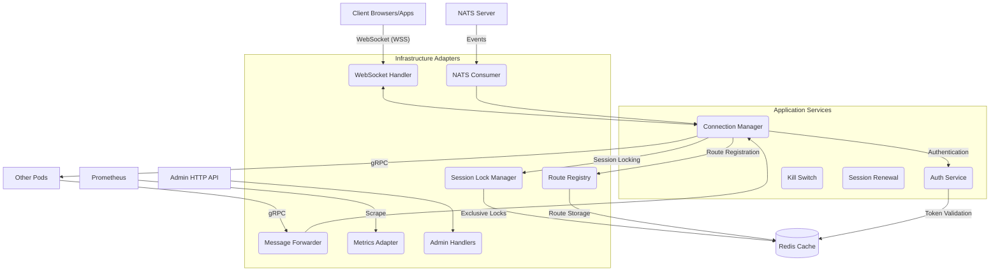
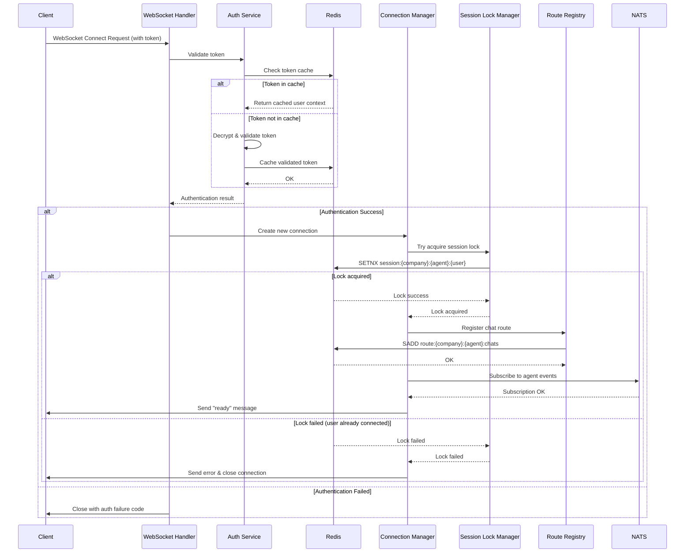
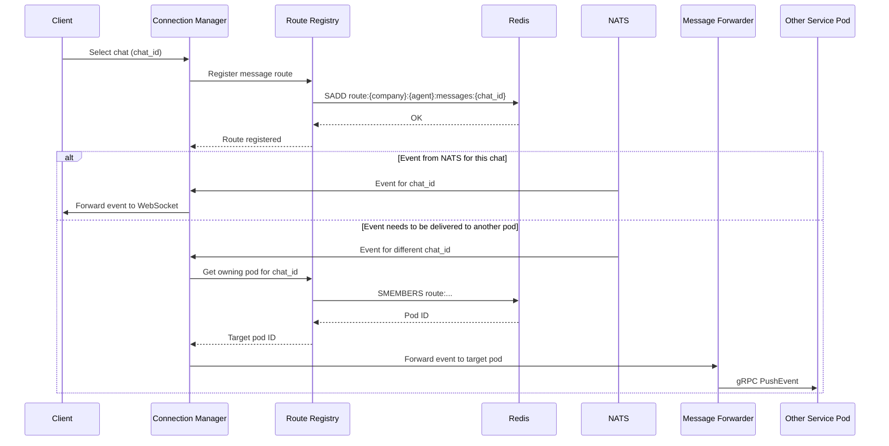
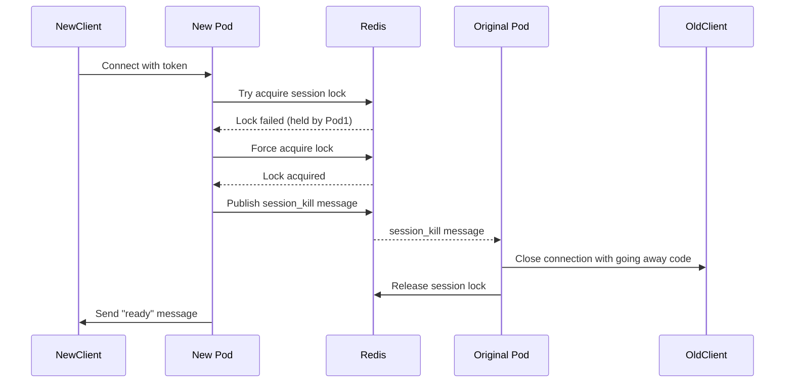

# System Architecture: Daisi WebSocket Service

## 1. High-level Overview

The Daisi WebSocket Service (daisi-ws-service) is a Go application designed to provide real-time WebSocket connectivity for agents and users in the Daisi platform. It serves as a critical communication gateway that handles WebSocket connections, authentication, session management, and message routing. Its primary functions include:

*   **WebSocket Connection Management:** Establishing, maintaining, and gracefully closing WebSocket connections with clients.
*   **Authentication:** Validating client tokens for both regular users and admin users before allowing connections.
*   **Session Management:** Ensuring exclusive user sessions with Redis-based locking mechanisms to prevent duplicate connections.
*   **Message Routing:** Registering routes in Redis to enable proper message delivery across multiple service instances.
*   **Event Forwarding:** Using gRPC to forward events between service instances when messages need to be delivered to users connected to different pods.
*   **NATS Integration:** Subscribing to NATS subjects for real-time events that need to be pushed to connected clients.
*   **Monitoring & Observability:** Providing metrics via Prometheus and structured logging via Zap.
*   **Resilience:** Implementing circuit breaker patterns, panic recovery, and connection health checks to maintain system stability.

The service is designed with a clean architecture approach, separating domain logic, application services, and infrastructure adapters. It uses Google Wire for dependency injection and offers configuration via YAML files and environment variables.

## 2. Core Components and Interactions

The system follows a modular design with clear separation of concerns:

**Component Breakdown:**

*   **`main.go` (Application Entrypoint):**
    *   Initializes the application using `bootstrap.InitializeApp()`.
    *   Creates the application context and starts the service.
    *   Manages graceful shutdown.

*   **`bootstrap` (Dependency Injection & Initialization):**
    *   Uses Google Wire (`wire_gen.go`) to assemble the application graph.
    *   `InitializeApp()`: Constructs and returns the `App` struct, which holds instances of all major components.
    *   Manages the lifecycle (creation and cleanup) of these components.

*   **`ConfigProvider` (`adapters/config/config.go`):**
    *   Uses Viper to load configuration from `config.yaml` and environment variables.
    *   Provides access to configuration values throughout the application.

*   **`Logger` (`adapters/logger/zap_adapter.go`):**
    *   Uses Zap for structured, leveled logging.
    *   Supports adding contextual information (request ID, user ID, company ID, etc.) to log messages.
    *   Implements the domain.Logger interface for consistent logging throughout the application.

*   **`WebSocket Handler` (`adapters/websocket/handler.go`):**
    *   Upgrades HTTP connections to WebSocket protocol.
    *   Initializes the WebSocket connection with proper configuration.
    *   Delegates connection management to the Connection Manager.
    *   Handles WebSocket protocol messages (ping/pong, close frames).

*   **`Connection Manager` (`application/connection_manager.go`):**
    *   Core service that manages WebSocket connections.
    *   Maintains a registry of active connections.
    *   Coordinates with Session Lock Manager to ensure exclusive sessions.
    *   Handles client messages, particularly for chat selection.
    *   Manages route registration and message distribution.

*   **`Auth Service` (`application/auth_service.go`):**
    *   Validates user and admin tokens.
    *   Uses Redis for token caching to improve performance.
    *   Decrypts and verifies token payloads.

*   **`Session Lock Manager` (`adapters/redis/session_lock_manager.go`):**
    *   Uses Redis to implement distributed locks for user sessions.
    *   Provides mechanisms for acquiring, refreshing, and releasing locks.
    *   Helps ensure a user can only have one active connection across the service's pods.

*   **`Route Registry` (`adapters/redis/route_registry.go`):**
    *   Maps users and chats to specific service pods.
    *   Enables message routing across multiple service instances.
    *   Automatically expires routes that are no longer active.

*   **`NATS Consumer` (`adapters/nats/consumer.go`):**
    *   Subscribes to NATS subjects for real-time events.
    *   Routes incoming NATS messages to the appropriate WebSocket connections.

*   **`Message Forwarder` (`adapters/grpc/forwarder_adapter.go`):**
    *   Uses gRPC to forward messages between service pods.
    *   Maintains a connection pool with circuit breaker functionality.
    *   Enables seamless message delivery regardless of which pod a client is connected to.

*   **`Kill Switch` (`application/kill_switch.go`):**
    *   Mechanism to force disconnect sessions when needed.
    *   Uses Redis PubSub for cross-pod communication.
    *   Essential for managing session migrations.

*   **`Metrics Adapter` (`adapters/metrics/prometheus_adapter.go`):**
    *   Collects operational metrics using Prometheus.
    *   Monitors connection counts, message rates, authentication success/failure, and more.

*   **`Admin Handlers` (`adapters/http/admin_handlers.go`):**
    *   Provides HTTP endpoints for administrative functions.
    *   Includes token generation and system management capabilities.

*   **`SafeGo` (`pkg/safego/safego.go`):**
    *   Utility for running goroutines with panic recovery.
    *   Enhances system resilience by preventing cascading failures from panicked goroutines.

## 3. Data Flow Diagram

The primary data flow through the service involves several key scenarios:

### 3.1 WebSocket Connection Establishment

### 3.2 Message Delivery (Chat Selection & Routing)

### 3.3 Session Migration (Kill Switch)

## 4. Key Design Decisions and Rationale

*   **Clean Architecture with Hexagonal Pattern:**
    *   **Rationale:** Clear separation between domain logic, application services, and infrastructure adapters. This makes the code more maintainable and testable while keeping domain logic isolated from external dependencies.

*   **Redis for Distributed Coordination:**
    *   **Rationale:** Redis provides fast, in-memory operations essential for distributed locking, session management, route registration, and token caching. Its PubSub capabilities also enable cross-pod communication for session kill switches.

*   **gRPC for Pod-to-Pod Communication:**
    *   **Rationale:** Efficient binary protocol with strong typing through Protocol Buffers. Enables low-latency, high-throughput communication between service pods for message forwarding.
    *   **Connection Pooling & Circuit Breaker:** Optimizes resource usage and provides fault tolerance if a pod becomes unreachable.

*   **NATS for Event Subscription:**
    *   **Rationale:** High-performance messaging system ideal for fan-out event delivery patterns. NATS offers the subject-based routing model that fits well with the service's needs for granular subscriptions.

*   **Token-based Authentication with AES-GCM Encryption:**
    *   **Rationale:** Secure, stateless authentication using encrypted tokens containing user context. Redis caching improves performance by reducing repeated decryption operations.

*   **Exclusive Session Management:**
    *   **Rationale:** Ensures users have only one active connection across the entire service cluster, preventing problems with duplicate message delivery and conflicting state.

*   **Route Registration System:**
    *   **Rationale:** Enables efficient message routing across multiple service pods. The TTL-based design automatically cleans up stale routes if pods crash or connections drop unexpectedly.

*   **Zap for Structured Logging:**
    *   **Rationale:** High-performance logging with structured data formats that are easily parseable by log aggregation systems. Context enrichment provides detailed tracing capabilities.

*   **Prometheus for Metrics:**
    *   **Rationale:** Industry-standard observability system that enables real-time monitoring, alerting, and visualization of service health and performance metrics.

*   **Safe Goroutines with Panic Recovery:**
    *   **Rationale:** The `safego` package ensures that panics in goroutines don't bring down the entire service, enhancing system resilience and stability.

*   **Admin API for Token Generation:**
    *   **Rationale:** Provides a secure mechanism for generating authenticated tokens for both regular users and administrators.

*   **Google Wire for Dependency Injection:**
    *   **Rationale:** Compile-time dependency injection that eliminates runtime reflection overhead while still providing clean component wiring and initialization.

## 5. System Constraints and Limitations

*   **Redis Dependency:**
    *   The service heavily relies on Redis for core functionality (session locking, route registry, token caching, kill switch). Any Redis outage would significantly impact service operation.
    *   Redis memory consumption scales with the number of active connections and routes.

*   **Connection Scalability:**
    *   Each WebSocket connection maintains state and consumes resources (goroutines, memory).
    *   The service needs to be horizontally scalable to handle a large number of concurrent WebSocket connections.
    *   Session migration between pods (using the kill switch) can cause brief connection interruptions.

*   **Message Ordering:**
    *   While NATS itself preserves message order within a subject, the overall system doesn't guarantee strict global message ordering across different sources or when message forwarding between pods is involved.

*   **Token Security:**
    *   Security depends on the strength of the AES encryption keys.
    *   Token TTL management is critical to prevent long-lived access after user permissions change.

*   **Network Reliability:**
    *   WebSocket connections are sensitive to network quality and may require reconnection logic on the client side.
    *   gRPC connections between pods could be impacted by network partitions.

*   **Potential Bottlenecks:**
    *   Redis operations during high-traffic periods (connection spikes).
    *   gRPC message forwarding under heavy cross-pod traffic.
    *   NATS subject fanout with many subscribers.

*   **Error Handling:**
    *   While the service implements circuit breakers and panic recovery, some error scenarios might still lead to connection drops and require client-side reconnection logic.

*   **Monitoring Coverage:**
    *   The metrics system focuses on key operational aspects, but additional custom metrics might be needed for specific business insights.

*   **Configuration Management:**
    *   The service uses a moderately complex configuration system that needs careful management across different environments.

## 6. Deployment and Operational Considerations

*   **Kubernetes Deployment:**
    *   The service is containerized and designed to run in Kubernetes with horizontal scaling.
    *   Pod identity is important for the route registry system and should be consistent.

*   **Network Requirements:**
    *   WebSocket endpoints need to be accessible to clients (potentially through a load balancer with WebSocket support).
    *   gRPC ports need to be accessible between pods within the cluster.
    *   NATS and Redis connections require low-latency network access.

*   **Load Balancing:**
    *   WebSocket connections should be sticky to pods once established, but initial connection establishment can be load-balanced.
    *   Health checks should verify the service's ability to establish new WebSocket connections.

*   **Resource Allocation:**
    *   Memory allocation should account for WebSocket connection buffers and potential message backlogs.
    *   CPU allocation needs to handle concurrent connections and message processing.
    *   Network bandwidth considerations for high-volume WebSocket traffic.

*   **Monitoring and Alerting:**
    *   Critical metrics to monitor:
        *   WebSocket connection count
        *   Authentication success/failure rates
        *   Message delivery rates and latencies
        *   gRPC client/server errors
        *   Redis operation latencies
        *   Session lock conflicts

*   **Failure Recovery:**
    *   The service should recover gracefully from Redis or NATS temporary outages.
    *   Client applications should implement reconnection strategies with backoff.

*   **Security Considerations:**
    *   WebSocket endpoints should use TLS (WSS).
    *   Admin endpoints need proper authorization controls.
    *   Redis and NATS connections should be secured within the cluster network.

## 7. Future Enhancements and Considerations

*   **Connection Draining During Deployments:**
    *   Implementing graceful connection draining during pod termination to minimize client disconnections.

*   **Enhanced Message Prioritization:**
    *   Adding message priority levels to ensure critical notifications are delivered ahead of lower-priority events.

*   **Client Libraries:**
    *   Developing standardized client libraries for common platforms to handle reconnection, authentication, and message parsing.

*   **Telemetry Tracing:**
    *   Adding distributed tracing (e.g., OpenTelemetry) to track message flow across the entire system.

*   **Message Persistence:**
    *   Optionally storing messages for offline clients to receive when they reconnect.

*   **Load Testing and Performance Tuning:**
    *   Conducting comprehensive load tests to identify bottlenecks and tune performance parameters.
    *   Optimizing Redis usage patterns for higher throughput.

*   **Enhanced Security Features:**
    *   Support for token rotation and revocation.
    *   Fine-grained access controls based on user roles and permissions.

*   **Expanded Monitoring:**
    *   Business-level metrics related to message types and patterns.
    *   User experience metrics (connection quality, latency distribution). 