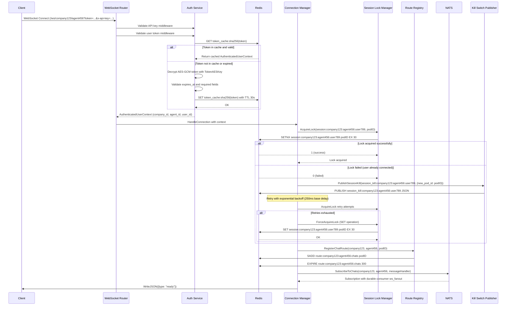

# System Architecture: Daisi WebSocket Service

## 1. High-level Overview

The Daisi WebSocket Service (daisi-ws-service) is a sophisticated Go application designed to provide real-time WebSocket connectivity for both users and administrators in the Daisi platform. Built with Go 1.23 and clean architecture principles, it serves as a critical communication gateway handling WebSocket connections, dual authentication systems, distributed session management, and intelligent message routing between NATS JetStream and browser clients.

### Primary Functions

*   **Dual WebSocket Endpoints:** User connections at `/ws/{company}/{agent}` and admin connections at `/ws/admin`
*   **Advanced Session Management:** Exclusive sessions with Redis-based distributed locking and automatic session migration
*   **Dual Authentication System:** API key + AES-GCM encrypted tokens for users and admins with Redis caching
*   **Intelligent Message Routing:** Redis-based route registry with automatic cross-pod message forwarding via gRPC
*   **NATS JetStream Integration:** Durable consumers with queue groups for reliable message processing
*   **Adaptive TTL Management:** Activity-based TTL optimization for session locks and routes
*   **Advanced WebSocket Features:** Buffered sending, backpressure handling, compression support, ping/pong health checks
*   **Circuit Breaker Pattern:** Fault-tolerant gRPC communication with connection pooling
*   **Comprehensive Observability:** Prometheus metrics, structured Zap logging, health checks
*   **Hot Configuration Reload:** File watching and SIGHUP signal support

The service follows clean architecture principles with hexagonal pattern, using Google Wire for compile-time dependency injection and offering extensive configuration via YAML files and environment variables.

## 2. Core Components and Architecture


### Component Breakdown

#### Entry Point & Bootstrap
*   **`cmd/daisi-ws-service/main.go`:** Application entry point using `bootstrap.InitializeApp()` with context management and graceful shutdown

*   **`internal/bootstrap/`:** Google Wire dependency injection with compile-time code generation:
    - `wire.go`: Wire provider definitions
    - `wire_gen.go`: Generated initialization code  
    - `providers.go`: Component provider functions
    - `app.go`: Main application structure

#### Configuration & Logging
*   **`internal/adapters/config/ConfigProvider`:** Viper-based configuration loading from YAML and environment variables with hot-reload via file watching and SIGHUP signal handling

*   **`internal/adapters/logger/ZapAdapter`:** Structured logging implementation with contextual information extraction (request_id, user_id, company_id, agent_id, event_id)

#### WebSocket Infrastructure
*   **`internal/adapters/websocket/Handler`:** User WebSocket endpoint handler (`/ws/{company}/{agent}`) with authentication middleware chain

*   **`internal/adapters/websocket/AdminHandler`:** Admin WebSocket endpoint handler (`/ws/admin`) with separate authentication flow

*   **`internal/adapters/websocket/Connection`:** Enhanced WebSocket connection wrapper with:
    - Buffered message sending with configurable capacity (default 100)
    - Backpressure handling policies: `drop_oldest` or `block`
    - Asynchronous writer goroutine with panic recovery
    - Ping/pong health check management
    - Context-aware lifecycle management

*   **`internal/adapters/websocket/Router`:** WebSocket route registration with middleware chains

#### Core Business Logic
*   **`internal/application/ConnectionManager`:** Central orchestrator managing:
    - Active connections registry (`sync.Map`)
    - Session lock coordination
    - Route registration and management
    - Cross-pod message forwarding decisions
    - Session migration via kill switch

*   **`internal/application/AuthService`:** Dual authentication system:
    - Company user tokens: AES-GCM encrypted with company_id, agent_id, user_id, expires_at
    - Admin tokens: AES-GCM encrypted with admin_id, subscription patterns, company restrictions
    - Redis caching with configurable TTL (30s users, 60s admins)
    - Token validation and context extraction

#### Session & Route Management
*   **`internal/adapters/redis/SessionLockManagerAdapter`:** Distributed session locking:
    - Redis SETNX operations for exclusive session acquisition
    - Lock keys: `session:{company}:{agent}:{user}` and `session:admin:{admin_id}`
    - TTL management with activity tracking
    - Force acquisition with SET operations
    - Lua scripts for atomic operations

*   **`internal/adapters/redis/RouteRegistryAdapter`:** Route management using Redis sets:
    - Chat routes: `route:{company}:{agent}:chats`
    - Message routes: `route:{company}:{agent}:messages:{chat_id}`
    - Pod membership tracking with SADD/SREM operations
    - TTL-based automatic cleanup
    - Activity recording for adaptive TTL

#### Messaging Infrastructure
*   **`internal/adapters/nats/ConsumerAdapter`:** NATS JetStream integration:
    - Durable consumer `ws_fanout` with queue groups
    - Subject subscriptions: `wa.{company}.{agent}.chats`, `wa.{company}.{agent}.messages.{chat_id}`, `wa.{company}.{agent}.agents`
    - Manual acknowledgment for reliability
    - Connection resilience with retry logic

*   **`internal/adapters/grpc/ForwarderAdapter`:** Cross-pod gRPC communication:
    - Connection pooling with health monitoring
    - Circuit breaker implementation (5 failures trigger 30s open state)
    - Retry logic for transient failures (UNAVAILABLE, DEADLINE_EXCEEDED)
    - Idle connection cleanup (300s default)
    - Protocol Buffer message serialization

*   **`internal/application/GRPCMessageHandler`:** gRPC server handler for incoming message forwarding requests

#### Session Migration
*   **`internal/adapters/redis/KillSwitchPubSubAdapter`:** Redis pub/sub for session migration:
    - User channels: `session_kill:{company}:{agent}:{user}`
    - Admin channels: `session_kill:admin:{admin_id}`
    - Pattern-based subscription with message routing
    - Graceful connection termination

*   **`internal/application/KillSwitchManager`:** Session migration orchestration with message handling and connection cleanup

#### Observability
*   **`internal/adapters/metrics/PrometheusAdapter`:** Comprehensive metrics:
    - Connection metrics: `dws_active_connections`, `dws_connection_duration_seconds`
    - Message metrics: `dws_messages_sent_total`, `dws_messages_received_total`
    - Authentication metrics: `dws_auth_success_total`, `dws_auth_failure_total`
    - gRPC metrics: `dws_grpc_messages_sent_total`, `dws_grpc_forward_retry_attempts_total`
    - Session lock metrics: `dws_session_lock_attempts_total`, `dws_session_lock_success_total`
    - Buffer metrics: `dws_websocket_buffer_used_count`, `dws_websocket_messages_dropped_total`

*   **`pkg/safego/SafeGo`:** Panic-safe goroutine execution with stack trace logging

## 3. Data Flow Diagrams

### 3.1 User WebSocket Connection Establishment



### 3.2 Chat Selection and Message Routing


### 3.3 Admin WebSocket Connection and System-Wide Event Streaming


## 4. Key Technical Implementation Details

### Clean Architecture with Google Wire
*   **Domain Layer:** Pure business interfaces in `internal/domain/` (Logger, NatsConsumer, SessionLockManager, RouteRegistry, MessageForwarder, etc.)
*   **Application Layer:** Business logic orchestration in `internal/application/` (ConnectionManager, AuthService, GRPCMessageHandler)
*   **Adapters Layer:** Infrastructure implementations in `internal/adapters/` (Redis, NATS, WebSocket, gRPC, HTTP)
*   **Dependency Injection:** Compile-time with Google Wire, no runtime reflection

### Redis Distributed Coordination
*   **Session Lock Keys:** 
    - Users: `session:{company}:{agent}:{user}` 
    - Admins: `session:admin:{admin_id}`
*   **Route Registry Keys:**
    - Chat routes: `route:{company}:{agent}:chats`
    - Message routes: `route:{company}:{agent}:messages:{chat_id}`
*   **Kill Switch Channels:**
    - Users: `session_kill:{company}:{agent}:{user}`
    - Admins: `session_kill:admin:{admin_id}`
*   **Token Cache Keys:** `token_cache:sha256(rawToken)` and `token_cache:admin_sha256(rawToken)`

### gRPC Protocol Buffer Schema
```protobuf
// internal/adapters/grpc/proto/dws_message_fwd.proto
service MessageForwardingService {
  rpc PushEvent(PushEventRequest) returns (PushEventResponse);
}

message EnrichedEventPayloadMessage {
  string event_id = 1;
  string company_id = 2;
  string agent_id = 3;
  string message_id = 4;
  string chat_id = 5;
  google.protobuf.Struct row_data = 6;
  string event_time = 7;
}
```

### NATS Subject Patterns
*   **General Chat Events:** `wa.{company}.{agent}.chats`
*   **Specific Chat Messages:** `wa.{company}.{agent}.messages.{chat_id}`
*   **Admin Agent Events:** `wa.{company}.{agent}.agents`
*   **JetStream Configuration:** Durable consumer `ws_fanout`, manual acknowledgment, queue groups for load balancing

### Authentication Token Structure
```go
// User Token (AES-GCM encrypted)
type AuthenticatedUserContext struct {
    CompanyID string    `json:"company_id"`
    AgentID   string    `json:"agent_id"`
    UserID    string    `json:"user_id"`
    ExpiresAt time.Time `json:"expires_at"`
    Token     string    `json:"-"` // Raw token for caching
}

// Admin Token (AES-GCM encrypted)  
type AdminUserContext struct {
    AdminID              string    `json:"admin_id"`
    ExpiresAt            time.Time `json:"expires_at"`
    SubscribedCompanyID  string    `json:"subscribed_company_id,omitempty"`
    SubscribedAgentID    string    `json:"subscribed_agent_id,omitempty"`
    CompanyIDRestriction string    `json:"company_id_restriction,omitempty"`
    Token                string    `json:"-"`
}
```

### WebSocket Message Protocol
```go
// Server-to-Client Messages
type BaseMessage struct {
    Type    string      `json:"type"`    // "ready", "event", "error"
    Payload interface{} `json:"payload,omitempty"`
}

// Client-to-Server Messages
type SelectChatMessagePayload struct {
    ChatID string `json:"chat_id"`
}
```

### Circuit Breaker Implementation
*   **Failure Threshold:** 5 consecutive failures per target pod
*   **Open Duration:** 30 seconds (configurable)
*   **Tracked Failures:** Connection errors, gRPC UNAVAILABLE/DEADLINE_EXCEEDED
*   **Success Reset:** Any successful gRPC call resets failure count
*   **Connection Cleanup:** Circuit trip closes pooled connections

### Adaptive TTL System
```yaml
adaptive_ttl:
  session_lock:
    enabled: false  # Currently disabled
    min_ttl_seconds: 15
    max_ttl_seconds: 30
    activity_threshold_seconds: 120
  message_route:
    enabled: true   # Active for message routes
    min_ttl_seconds: 300
    max_ttl_seconds: 900
    activity_threshold_seconds: 600
```

## 5. Configuration System

### Primary Configuration File (config/config.yaml)
```yaml
server:
  http_port: 8080
  grpc_port: 50051
  pod_id: ""  # Set via DAISI_WS_SERVER_POD_ID
  enable_reflection: false

nats:
  url: "nats://nats:4222"
  stream_name: "wa_stream"
  consumer_name: "ws_fanout"
  retry_on_failed_connect: true

redis:
  address: "redis:6379"
  
auth:
  secret_token: ""  # Set via DAISI_WS_AUTH_SECRET_TOKEN
  token_aes_key: ""  # Set via DAISI_WS_AUTH_TOKEN_AES_KEY (64-char hex)
  admin_token_aes_key: ""  # Set via DAISI_WS_AUTH_ADMIN_TOKEN_AES_KEY
  token_generation_admin_key: ""  # Set via DAISI_WS_AUTH_TOKEN_GENERATION_ADMIN_KEY
  token_cache_ttl_seconds: 30
  admin_token_cache_ttl_seconds: 60

app:
  session_ttl_seconds: 30
  route_ttl_seconds: 300
  ttl_refresh_interval_seconds: 10
  websocket_message_buffer_size: 100
  websocket_backpressure_drop_policy: "drop_oldest"  # or "block"
  ping_interval_seconds: 20
  pong_wait_seconds: 60
  write_timeout_seconds: 30
  grpc_client_forward_timeout_seconds: 5
  grpc_pool_idle_timeout_seconds: 300
  grpc_pool_health_check_interval_seconds: 60
  grpc_circuitbreaker_fail_threshold: 5
  grpc_circuitbreaker_open_duration_seconds: 30
```

### Environment Variable Overrides
All configuration values can be overridden using the `DAISI_WS_` prefix:
```bash
DAISI_WS_SERVER_HTTP_PORT=8080
DAISI_WS_SERVER_POD_ID=ws-service-1
DAISI_WS_NATS_URL=nats://localhost:4222
DAISI_WS_REDIS_ADDRESS=localhost:6379
DAISI_WS_AUTH_SECRET_TOKEN=your-secret-token
DAISI_WS_AUTH_TOKEN_AES_KEY=your-64-char-hex-key
```

## 6. Observability and Monitoring

### Prometheus Metrics (Detailed)
*   **Connection Metrics:**
    - `dws_active_connections`: Current active WebSocket connections by type
    - `dws_connections_total`: Total connections established counter
    - `dws_connection_duration_seconds`: Connection lifetime histogram

*   **Message Metrics:**
    - `dws_messages_sent_total`: Messages sent counter by type (ready, event, error)
    - `dws_messages_received_total`: NATS messages received by subject
    - `dws_websocket_messages_dropped_total`: Dropped messages by reason and session

*   **Authentication Metrics:**
    - `dws_auth_success_total`: Successful authentications by type (company, admin)
    - `dws_auth_failure_total`: Failed authentications by type and reason

*   **gRPC Metrics:**
    - `dws_grpc_messages_sent_total`: gRPC forwarding attempts by target pod
    - `dws_grpc_forward_retry_attempts_total`: Retry attempts by pod
    - `dws_grpc_forward_retry_success_total`: Successful retries
    - `dws_grpc_forward_retry_failure_total`: Failed retries
    - `dws_grpc_pool_connections_created_total`: Connection pool metrics
    - `dws_grpc_pool_connections_closed_total`: Closed connections by reason
    - `dws_grpc_pool_size`: Current pool size gauge
    - `dws_grpc_circuitbreaker_tripped_total`: Circuit breaker activations

*   **Session Lock Metrics:**
    - `dws_session_lock_attempts_total`: Lock acquisition attempts
    - `dws_session_lock_success_total`: Successful lock acquisitions
    - `dws_session_conflicts_total`: Session conflicts by type

*   **Buffer Metrics:**
    - `dws_websocket_buffer_capacity`: Buffer capacity by session
    - `dws_websocket_buffer_used_count`: Current buffer usage

### Structured Logging with Context
*   **Contextual Fields:** request_id, event_id, user_id, company_id, agent_id, admin_id
*   **Operation Tracking:** Detailed operation logging for debugging
*   **Error Context:** Rich error information with stack traces for panics
*   **Performance Tracking:** Duration logging for critical operations

### Health Check Endpoints
*   **`/health`:** Basic liveness probe
*   **`/ready`:** Readiness probe checking NATS, Redis, and gRPC dependencies
*   **`/metrics`:** Prometheus metrics endpoint

## 7. Deployment Architecture

### Kubernetes Deployment Considerations
*   **Multi-Pod Scaling:** Horizontal scaling with session migration via kill switch
*   **Pod Identity:** Consistent `SERVER_POD_ID` for route registry (e.g., Pod IP or name)
*   **Service Mesh:** gRPC communication between pods within cluster
*   **Load Balancer:** WebSocket-aware load balancer with session affinity considerations

### Network Architecture
```yaml
# Service Configuration
apiVersion: v1
kind: Service
metadata:
  name: daisi-ws-service
spec:
  ports:
  - name: http
    port: 8080
    targetPort: 8080
  - name: grpc
    port: 50051
    targetPort: 50051
  selector:
    app: daisi-ws-service
```

### Resource Requirements
*   **Memory:** Base + (connections × buffer_size × message_size) + connection pools
*   **CPU:** Message processing, JSON serialization, encryption operations
*   **Network:** WebSocket traffic, gRPC forwarding, Redis/NATS communication

## 8. Security Architecture

### Authentication Flow
1. **API Key Validation:** Static secret token verification
2. **Token Decryption:** AES-GCM decryption with environment-specific keys
3. **Token Validation:** Expiration and required field checks
4. **Context Caching:** Redis-based caching with appropriate TTL
5. **Session Management:** Exclusive session enforcement with conflict resolution

### Security Measures
*   **Encryption:** AES-256-GCM for token encryption
*   **Key Management:** Environment-based key configuration
*   **Session Isolation:** Exclusive sessions with distributed locking
*   **Admin Restrictions:** Company and agent-level access controls
*   **Transport Security:** WSS (WebSocket Secure) for external connections

## 9. Performance Characteristics

### Scalability Targets
*   **Concurrent Connections:** ≥ 10,000 per pod
*   **Message Delivery Latency:** ≤ 100ms (P95)
*   **End-to-End Latency:** ≤ 200ms (CDC → WebSocket)
*   **Cross-Pod Forwarding:** ≤ 50ms
*   **Availability:** ≥ 99.95% over 30 days

### Optimization Features
*   **Asynchronous Message Sending:** Non-blocking WebSocket writes with buffering
*   **Connection Pooling:** gRPC client connection reuse with health monitoring
*   **Circuit Breakers:** Failure isolation and automatic recovery
*   **Adaptive TTL:** Activity-based resource management
*   **Token Caching:** Reduced encryption overhead for frequent authentications

## 10. Failure Scenarios and Recovery

### Redis Outage
*   **Session Management:** Graceful degradation, connections continue but no new exclusive sessions
*   **Route Registry:** Local fallback, potential message duplication
*   **Recovery:** Automatic reconnection with session re-establishment

### NATS Outage  
*   **Message Flow:** Connection maintains but no new events
*   **Recovery:** Automatic reconnection with durable consumer catch-up

### Pod Failures
*   **Session Migration:** Automatic via kill switch pub/sub
*   **Connection Recovery:** Client-side reconnection required
*   **State Recovery:** Stateless design enables immediate replacement

### Circuit Breaker Activation
*   **gRPC Failures:** Temporary isolation of failing pods
*   **Automatic Recovery:** Exponential backoff with health monitoring
*   **Fallback:** Local delivery only until recovery

## 11. Monitoring and Alerting Strategy

### Critical Alerts
*   **High Authentication Failure Rate:** > 10% failure rate over 5 minutes
*   **Session Conflict Spikes:** Unusual session migration activity
*   **Circuit Breaker Activations:** gRPC communication failures
*   **WebSocket Connection Health:** Connection drops or high latency
*   **Message Delivery Failures:** NATS or Redis connectivity issues

### Performance Monitoring
*   **Connection Metrics:** Active connections, connection duration
*   **Message Flow:** Delivery rates, latency percentiles
*   **Resource Usage:** Memory, CPU, network bandwidth
*   **Error Rates:** Authentication, message delivery, gRPC forwarding

### Operational Dashboards
*   **Real-time Connection Status:** Active connections by type and pod
*   **Message Flow Visualization:** Event processing rates and latency
*   **System Health Overview:** Dependency status and error rates
*   **Performance Trends:** Historical metrics and capacity planning 