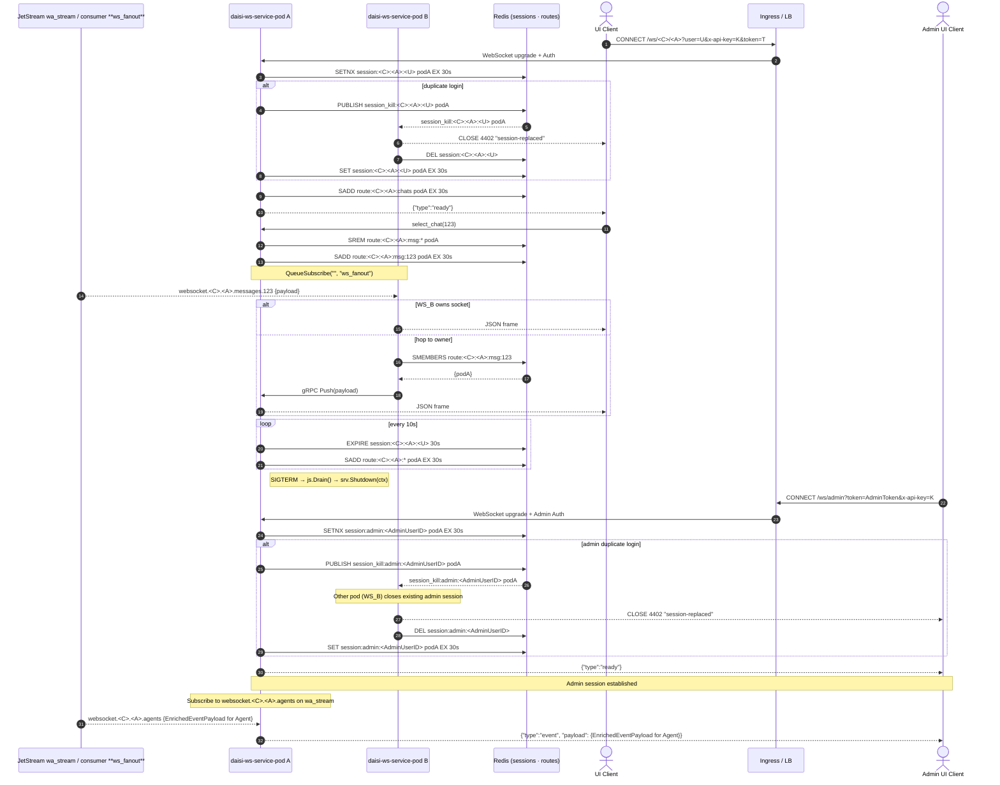

# Technical Requirements & Architecture – **daisi-ws-service**

*Document owner:* @prasetyopandu  
*Last updated:* 18 May 2025

---

## 1. Purpose & Scope

This document translates the Product Requirements Document (PRD) for **daisi-ws-service** into concrete technical requirements and an actionable architecture blueprint. It clarifies how the service interacts with upstream **daisi-cdc-consumer-service** and downstream browser clients via WebSocket.

---

## 2. Functional Requirements (Implementation Order)

This section outlines the functional requirements, ordered by a suggested sequence of implementation.

### Phase 1: Basic WebSocket Connectivity & Authentication

| Ref     | Requirement                         | Acceptance Criteria                                                                                           |
| ------- | ----------------------------------- | -------------------------------------------------------------------------------------------------------------- |
| **FR-1**  | WebSocket upgrade endpoint         | Accepts `GET /ws/<company>/<agent>?user=<U>&token=<T>&x-api-key=<K>`, using `github.com/coder/websocket v1.8.13` with sub-protocol `json.v1`. |
| **FR-2**  | API-key guard                      | Middleware `AuthRequired` blocks any request missing a valid `x-api-key` shared secret. Pre-upgrade failures return HTTP 401. |
| **FR-3**  | Company token authentication       | AES-GCM decrypt and validate `token` parameter using `TOKEN_AES_KEY`. Cache successful validation result (e.g., `{company_id, agent_id, user_id, is_admin, expires_at}`) in Redis under `token_cache:<sha256_of_token>` for 30s. Pre-upgrade failures return HTTP 403. |
| **FR-11** | Ping/Pong Heartbeat                | Server sends Ping frame every 20s. If Pong not received after 2 missed pings (~40s-60s timeout), connection is closed. |
| **FR-12** | `json.v1` Sub-protocol Client Messages | Client can send `{"type":"select_chat","chat_id":"<chat_id_value>"}`. Server sends `{"type":"ready"}` upon successful connection and `{"type":"error", "payload": ErrorResponse}` for errors. (See Section 10 for `ErrorResponse`). Initial server implementation should handle sending `ready` and `error`. Client `select_chat` handling can be developed alongside FR-5. |

### Phase 2: Core Session Management & Initial NATS Integration

| Ref     | Requirement                         | Acceptance Criteria                                                                                           |
| ------- | ----------------------------------- | -------------------------------------------------------------------------------------------------------------- |
| **FR-9A** | Basic Observability Setup          | Initial structured Zap JSON logging configured. Basic `/metrics` endpoint exposed (Prometheus client library integrated). Further metric definitions in FR-9B. |
| **FR-4**  | Single-tab session enforcement     | Ensure one active socket per `(company, agent, user)` via Redis `SETNX session:<C>:<A>:<U> <pod_id> EX 30s` and `session_kill:<C>:<A>:<U>` pub/sub. `<pod_id>` is the unique, routable identifier of the pod (e.g., Pod IP). |
| **FR-6**  | Automatic chat subscription        | On connect, subscribe to NATS subject `websocket.<C>.<A>.chats` using JetStream `QueueSubscribe("", "ws_fanout")` on `wa_stream`. Payload is `EnrichedEventPayload` (see Section 6). Basic handling to forward these to connected clients. |

### Phase 3: Message Routing, Fan-out & Advanced Observability

| Ref     | Requirement                         | Acceptance Criteria                                                                                           |
| ------- | ----------------------------------- | -------------------------------------------------------------------------------------------------------------- |
| **FR-5**  | Dynamic route registry             | Track pod ownership of chat/message routes via Redis. On connect, pod registers `SADD route:<C>:<A>:chats <pod_id> EX 30s`. On `select_chat(X)` (from FR-12), pod registers `SADD route:<C>:<A>:messages:<X> <pod_id> EX 30s` and clears previous specific message routes it owned for that session. The `<logical>` part of a route can be `chats` or `messages`. |
| **FR-7**  | Per-thread message fan-out         | After `select_chat(X)`, client receives messages from `websocket.<C>.<A>.messages.<X>`. If message delivered to non-owner pod, forward via gRPC `Push(EnrichedEventPayload)` to owner pod. gRPC failures (timeout, target unavailable) should be logged with `request_id`; message may be dropped after retries (e.g., 1 retry). |
| **FR-9B** | Comprehensive Observability        | Implement all custom Prometheus metrics defined (e.g., `dws_*` counters, gauges) and the connection-duration histogram (buckets: 1m, 5m, 15m, 30m, 1h, 4h, 8h, 24h). Ensure `request_id` is consistently included in logs for tracing. |

### Phase 4: Stability & Operational Readiness

| Ref     | Requirement                         | Acceptance Criteria                                                                                           |
| ------- | ----------------------------------- | -------------------------------------------------------------------------------------------------------------- |
| **FR-8**  | TTL refresh loop                   | Every 10s, pod extends expirations on its owned session keys (e.g., `session:<C>:<A>:<U>`) and active route keys (e.g., `route:<C>:<A>:chats`, `route:<C>:<A>:messages:<X>`) back to 30s. Refresh operations must only target keys specifically managed by the pod. |
| **FR-10** | Graceful drain & back-pressure    | On `SIGTERM`, follow detailed shutdown sequence (see Section 5.3). Maintain JetStream lag ≤ 1s for consumer `ws_fanout`. NATS JetStream consumer `ws_fanout` uses `AckPolicy=Explicit` and `MaxAckPending=5000` (or configurable). Messages are ACK'd after successful delivery to WebSocket client or successful gRPC forwarding. |

### Phase 5: Admin WebSocket & Event Streaming

| Ref         | Requirement                         | Acceptance Criteria                                                                                                                               |
| ----------- | ----------------------------------- | ------------------------------------------------------------------------------------------------------------------------------------------------- |
| **FR-ADMIN-1**| Admin WebSocket endpoint          | Accepts `GET /ws/admin?token=<AdminToken>&x-api-key=<K>`. Uses existing WebSocket library and `json.v1` sub-protocol. Admin token validated (e.g., specific claim or separate validation logic). |
| **FR-ADMIN-2**| Agent table event subscription    | On admin connect, subscribe to NATS subject `websocket.<company_id>.<agent_id>.agents` (published on `wa_stream` by `daisi-cdc-consumer-service`) using existing JetStream consumer logic (e.g., `ws_fanout` consumer configuration adapted for this additional subject). Payload is `EnrichedEventPayload` where `row_data` contains agent information. |
| **FR-ADMIN-3**| Admin single-tab session          | Ensure one active socket per admin user (e.g., `AdminUserID` from token) via Redis `SETNX session:admin:<AdminUserID> <pod_id> EX 30s` and `session_kill:admin:<AdminUserID>` pub/sub. |

### Phase 6: Stability & Operational Readiness (Previously Phase 4)

| Ref     | Requirement                         | Acceptance Criteria                                                                                           |
| ------- | ----------------------------------- | -------------------------------------------------------------------------------------------------------------- |
| **FR-8**  | TTL refresh loop                   | Every 10s, pod extends expirations on its owned session keys (e.g., `session:<C>:<A>:<U>`, `session:admin:<AdminUserID>`) and active route keys (e.g., `route:<C>:<A>:chats`, `route:<C>:<A>:messages:<X>`) back to 30s. Refresh operations must only target keys specifically managed by the pod. |
| **FR-10** | Graceful drain & back-pressure    | On `SIGTERM`, follow detailed shutdown sequence (see Section 5.3). Maintain JetStream lag ≤ 1s for the NATS consumer (e.g., `ws_fanout` on `wa_stream` which handles all relevant subjects including `websocket.*.*.agents`). NATS JetStream consumer uses `AckPolicy=Explicit` and `MaxAckPending` (configurable). Messages are ACK'd after successful delivery to WebSocket client or successful gRPC forwarding. |

### Out of Scope

- CI/CD pipelines, Helm charts & Kubernetes manifests  
- Browser client SDK & UI logic  
- Multi-region replication  

---

## 3. Non-functional Requirements

| Aspect                              | Target                                   |
| ----------------------------------- | ---------------------------------------- |
| Connection fan-out latency (P95)    | ≤ 100 ms (JetStream → browser)           |
| End-to-end latency budget           | ≤ 200 ms (CDC → browser)                 |
| Concurrent sockets per replica      | ≥ 10 000                                  |
| Availability                        | ≥ 99.95 % over 30 days                   |
| Crash-loop budget                   | ≤ 3 pod restarts per day                 |

---

## 4. System Context



---

## 5. Architecture Overview

### 5.1 Technical Architecture

| Layer / Concern       | Technology                                        | Notes                                                      |
| --------------------- | ------------------------------------------------- | ---------------------------------------------------------- |
| Language & Build      | Go 1.23, CGO_ENABLED=0, multi-stage Docker (Bookworm-slim) | —                                                          |
| WebSocket library     | `github.com/coder/websocket v1.8.13` with custom ping-pong       | Lightweight, context-aware. Ping interval 20s, 2 missed pongs timeout. |
| Broker                | NATS JetStream (`wa_stream` consumer `ws_fanout`) | Push mode, `DeliverPolicy=All`, `AckPolicy=Explicit`. ACK after client/gRPC delivery. `wa_stream` handles subjects `websocket.*.*.chats`, `websocket.*.*.messages.*`, and `websocket.*.*.agents` (for admin clients). |
| Cross-pod RPC         | gRPC over mTLS                                    | Forward events when non-owner pod receives message. Uses routable pod identifiers (e.g., Pod IP). Kubernetes headless service for discovery. |
| Session store         | Redis 7 single-shard, LRU, maxmemory 200 MiB      | Keys expire 30 s. Use helper functions for key generation (see Section 5.2). Includes keys for admin sessions. |
| Authentication & Authorization | API-key guard + AES-GCM token auth        | Handled by `AuthRequired` & `CheckTokenAuth` middleware (cached in Redis 30s). Admin tokens might have specific claims or use a dedicated validation path. |
| Config                | Viper (ENV > YAML), hot reload on `SIGHUP`        | SIGHUP triggers re-read of config file; relevant components updated. See example YAML structure in Section 7.1. |
| Dependency Injection  | Google Wire                                       | Compile-time DI wiring with explicit dependency graphs     |
| Observability (Metrics & Logs) | Prometheus metrics, **structured Zap JSON logs via a custom adapter** | `dws_*` custom metrics. See FR-9 for histogram buckets. **`request_id` (and other context fields like `event_id` if available) automatically included in logs from `context.Context` by the adapter.** |
| Tracing               | OpenTelemetry (optional)                          | `request_id` (propagated from NATS message header `X-Request-ID` if present, otherwise generated at ingress by `daisi-ws-service`) will be used as the trace ID. **It must be injected into `context.Context` (e.g., using a `logger.RequestIDKey` or similar mechanism) when consuming events or handling requests. The logger adapter will then automatically include it in log entries. This `context.Context` (carrying the `request_id`) should be propagated through gRPC calls (e.g., via gRPC metadata) for end-to-end correlation.** |
| Deployment            | Helm chart; HPA on CPU & `jetstream_lag_seconds`; PDB=1 | —                                                          |
| Graceful shutdown     | Detailed sequence (see Section 5.3)               | Ensure no message loss on `SIGTERM`                        |

### 5.2 Package Layout

```
daisi-ws-service/
├── cmd/
│   └── daisi-ws-service/
│       └── main.go          # Bootstrap DI, wire dependencies, start HTTP & gRPC servers, NATS consumer.
├── internal/
│   ├── domain/              # Pure models (e.g., Session, RouteInfo, AuthenticatedUserContext) & port interfaces (SessionStore, RouteRegistry, KillPublisher, EventForwarder, TokenAuthenticator, APIKeyValidator).
│   ├── application/         # Use-cases orchestrating domain logic and adapter interactions.
│   │   ├── connection_manager.go # Handles WebSocket connection lifecycle (session, route registration, teardown), using validated user context.
│   │   ├── message_dispatcher.go # Handles incoming NATS messages, determines if local delivery or gRPC forward is needed.
│   │   ├── grpc_handler.go    # Implements the gRPC server interface, receives forwarded messages and passes to local delivery.
│   │   └── auth_service.go    # Application service for token validation logic, potentially using domain.TokenAuthenticator.
│   ├── adapters/            # Infrastructure bindings and framework-specific implementations.
│   │   ├── middleware/      # HTTP Middlewares.
│   │   │   └── auth.go        # Defines `APIKeyAuthMiddleware` (FR-2) and `CompanyTokenAuthMiddleware` (FR-3). These wrap HTTP handlers.
│   │   ├── websocket/       # WebSocket specific logic.
│   │   │   ├── handler.go     # HTTP handler for WebSocket upgrades (`/ws/...`). Manages client connections (read/write loops). Invoked after auth middlewares pass.
│   │   │   ├── router.go      # Defines WebSocket endpoint routes (e.g., `/ws/<company>/<agent>`). Applies auth middlewares from `adapters/middleware/` to these routes.
│   │   │   ├── protocol.go    # Handles `json.v1` message serialization/deserialization (e.g., `select_chat`, `ready`, `event`, `error` messages).
│   │   │   └── conn.go        # Wrapper around `github.com/coder/websocket v1.8.13` for custom logic like ping/pong, graceful close.
│   │   ├── nats/            # JetStream consumer logic.
│   │   │   └── consumer.go    # Subscribes to NATS subjects, receives messages, passes to `application/message_dispatcher.go`. Handles ACK/NACK.
│   │   ├── redis/           # Redis client implementation for SessionStore, RouteRegistry, and token caching used by auth_service/middleware.
│   │   │   ├── session_store.go
│   │   │   ├── route_registry.go
│   │   │   └── token_cache.go   # Implements caching logic for `CompanyTokenAuthMiddleware`.
│   │   ├── grpc/            # gRPC server for inter-pod communication and client for forwarding.
│   │   │   ├── server.go      # Implements the gRPC service definition (e.g., `PushService`). Listens on `GRPC_PORT`. Receives `Push` requests and delegates to `application/grpc_handler.go`.
│   │   │   ├── client.go      # Implements `domain.EventForwarder`. Handles connecting to other pods and sending `Push` requests.
│   │   │   └── proto/         # Protocol Buffer definitions for gRPC services and messages (e.g., `push.proto`).
│   │   ├── metrics/         # Prometheus HTTP handler and metric registration (`/metrics`).
│   │   ├── config/          # Viper config loader & reloader.
│   │   └── logger/          # **Implements domain.Logger interface using a ZapAdapter. Handles structured JSON logging, extracts request_id & other fields from context.**
│   └── bootstrap/           # Dependency wiring (Google Wire) - defines providers and injectors.
└── pkg/                     # Shared utility functions (e.g., Redis key generation, **context keys for logger (e.g., RequestIDKey)**, request_id handling, crypto for AES-GCM token decryption/validation).
```
Recommend using helper functions in `pkg/rediskeys` (previously `pkg/redis`) for consistent Redis key generation, e.g., `pkg/rediskeys/keys.go`:
```go
// pkg/rediskeys/keys.go
package rediskeys

import "fmt"

// computeHash would be a utility function, e.g., in pkg/utils or pkg/crypto
func computeHash(input string) string {
	// simplified placeholder for actual hash function like SHA256
	return fmt.Sprintf("hashed_%s", input)
}

func SessionKey(company, agent, user string) string { return fmt.Sprintf("session:%s:%s:%s", company, agent, user) }
func RouteKeyChats(company, agent string) string { return fmt.Sprintf("route:%s:%s:chats", company, agent) }
func RouteKeyMessages(company, agent, chatID string) string { return fmt.Sprintf("route:%s:%s:messages:%s", company, agent, chatID) }
func TokenCacheKey(hashedToken string) string { return fmt.Sprintf("token_cache:%s", hashedToken) } // Takes hashed token to avoid storing raw token as key part
func AdminSessionKey(adminUserID string) string { return fmt.Sprintf("session:admin:%s", adminUserID) } // Key for admin sessions
// ... any other key generation functions
```


### 5.3 Cross-cutting Concerns

- **Error Handling**  
  Centralized Error Types (see Section 10) for WebSocket close codes and HTTP JSON error responses. gRPC forwarding failures (FR-7) are logged and retried once before dropping.

- **Observability (Metrics & Logs)**  
  Prometheus metrics (`dws_*`, connection duration histogram with defined buckets), **structured Zap JSON logs provided by a custom `ZapAdapter` (see `internal/adapters/logger/`). `request_id` (propagated via `context.Context` using a defined key like `logger.RequestIDKey`) must be present in all log messages related to a request or event flow, along with other contextual fields like `event_id` if applicable and available in the context.**

- **Tracing**  
  `request_id` (propagated from NATS message header `X-Request-ID` if present, otherwise generated at ingress by `daisi-ws-service`) will be used as the trace ID. **It must be injected into `context.Context` (e.g., using a `logger.RequestIDKey` or similar mechanism) when consuming events or handling requests. The logger adapter will then automatically include it in log entries. This `context.Context` (carrying the `request_id`) should be propagated through gRPC calls (e.g., via gRPC metadata) for end-to-end correlation.**

- **Graceful shutdown & Back-pressure**  
  The following sequence ensures minimal message loss and polite connection handling on `SIGTERM`:
  1. Stop accepting new WebSocket connections on the HTTP listener.
  2. Initiate `js.Drain()` for the NATS JetStream consumer (`ws_fanout`) and wait for completion or timeout. This stops new messages from being processed and ensures all in-flight messages are handled.
  3. For all active WebSocket connections:
      a. Send a WebSocket close frame with code 1001 ("Going Away").
      b. Wait for a brief period (e.g., 1-2 seconds) for clients to acknowledge the close.
      c. Forcibly close connections that did not acknowledge.
  4. Shutdown the HTTP server (`srv.Shutdown(ctx)`).
  5. Clean up other resources (e.g., close Redis client connections if pooled).
  Maintain JetStream consumer lag ≤ 1s.

---

## 6. Data Model & Mapping

The primary data payload received by `daisi-ws-service` from NATS JetStream (on subjects like `websocket.<company_id>.<agent_id>.chats` and `websocket.<company_id>.<agent_id>.messages.<chat_id>`) is the `EnrichedEventPayload`.

Refer to the `daisi-cdc-consumer-service` documentation ([`cdc-service-docs/schemas.md`](./cdc-service-docs/schemas.md)) for the full JSON contract of `EnrichedEventPayload` and the NATS subject patterns published by the upstream service. `daisi-ws-service` consumes these exact subjects and payloads. Key upstream subjects consumed are:

- **Chat list updates**: `websocket.<company_id>.<agent_id>.chats` (on `wa_stream`)
- **Specific message thread updates**: `websocket.<company_id>.<agent_id>.messages.<chat_id>` (on `wa_stream`)
- **Agent table events (for admin)**: `websocket.<company_id>.<agent_id>.agents` (on `wa_stream`). The payload is `EnrichedEventPayload` where `row_data` contains agent information.

---

## 7. Deployment & Infrastructure

### Environment Variables

| Var                | Default                      | Description                                                 |
| ------------------ | ---------------------------- | ----------------------------------------------------------- |
| `NATS_URL`         | `nats://nats:4222`           | JetStream endpoint                                          |
| `REDIS_ADDR`       | `redis:6379`                 | Redis for sessions & routes                                 |
| `SECRET_TOKEN`     | —                            | Shared API key for WebSocket auth (must be set)             |
| `TOKEN_AES_KEY`    | —                            | AES-GCM key for company token decryption (must be set, e.g., 32-byte hex encoded) |
| `POD_IP`           | — (from Downward API)        | Pod's own IP address, used as `<pod_id>` in Redis.          |
| `VIPER_CONFIG_NAME`| `config`                     | Base name of the config file (e.g., `config.yaml`)          |
| `VIPER_CONFIG_PATH`| `/app/config`                | Path to look for the config file.                           |
| `LOG_LEVEL`        | `info`                       | Zap log level                                              |
| `GRPC_PORT`        | `50051`                      | Port for inter-pod gRPC communication.                      |

### Kubernetes

- **Helm Chart** with deployment, service, HPA, and PDB  
- **HPA**: scale on CPU ≥ 70% or `jetstream_lag_seconds > 1s`  
- **Liveness**: HTTP `/healthz` + Redis ping  
- **Readiness**: WebSocket listener + successful Redis connection  

### 7.1 Example YAML Configuration (`config/config.yaml`)

```yaml
# Example config.yaml structure
# Values here can be overridden by environment variables (e.g., VIPER_LOG_LEVEL or DWS_LOG_LEVEL if prefix is set)

log:
  level: "info" # Default log level (info, debug, warn, error)

server:
  port: "8080"
  readTimeoutSeconds: 5
  writeTimeoutSeconds: 10
  idleTimeoutSeconds: 60
  grpcPort: "50051"

nats:
  url: "nats://nats:4222"
  streamName: "wa_stream"       # For regular client messages and admin agent events
  consumerName: "ws_fanout"     # Base name for consumer logic handling all relevant subjects
  ackWaitSeconds: 30 
  maxAckPending: 5000

redis:
  address: "redis:6379"
  password: "" # Optional, use "" if no password
  db: 0
  defaultTTLSeconds: 30

websocket:
  subprotocol: "json.v1"
  pingIntervalSeconds: 20
  pongWaitSeconds: 45 # Should be > pingIntervalSeconds
  writeTimeoutSeconds: 10

auth:
  tokenCacheTTLSeconds: 30
  # SECRET_TOKEN and TOKEN_AES_KEY are typically set via ENV for security

# Hot-reloadable settings can be listed here or implied by Viper's watch functionality.
# For example, log.level could be made hot-reloadable.
```

---

## 8. Risks & Mitigations

| Risk                           | Impact                                | Mitigation                                                  |
| ------------------------------ | ------------------------------------- | ----------------------------------------------------------- |
| Session lock race              | Duplicate sessions                    | Use Redis `SETNX session:<C>:<A>:<U> <pod_id> EX 30s` + atomic TTL refresh for owned keys; `session_kill` pub/sub as fallback; integration tests. |
| Redis eviction ghost sessions  | Stale session state, potential misrouting | Monitor `redis_evicted_keys_total`; alert on high eviction. Ensure critical keys (active sessions, routes) have appropriate TTLs and are refreshed. Consider Redis memory policies. |
| Event delivered to wrong pod   | Extra hop latency                     | gRPC hop < 5 ms (target); alert if > 20 ms. Ensure efficient pod discovery for gRPC. |
| NATS Message ACK failure       | Message re-delivery, potential duplicates if client-side not idempotent | Robust ACK logic after successful client send / gRPC forward. Monitor NATS redelivery rates. Client should handle message `event_id` for deduplication if necessary. |

---

## 9. Open Questions

| # | Area                | Question                                                                 |
| - | ------------------- | ------------------------------------------------------------------------ |
| 1 | Redis eviction      | How should we handle session ghosting when Redis evicts keys under pressure? |

---

## 10. Centralized Error Types

We define a centralized error type for all WebSocket and HTTP error responses to ensure consistency and ease of handling.

### 10.1 Error Payload Structure

| Field     | Type    | Description                        |
| --------- | ------- | ---------------------------------- |
| `code`    | string  | Machine-readable error code        |
| `message` | string  | Human-readable error description   |
| `details` | string  | Optional additional context        |

### 10.2 Go Type Definitions

```go
// ErrorCode represents a specific error condition.
type ErrorCode string

const (
    ErrInvalidAPIKey       ErrorCode = "InvalidAPIKey"       // HTTP 401, WS Close 4401
    ErrInvalidToken        ErrorCode = "InvalidToken"        // HTTP 403, WS Close 4403
    ErrSessionConflict     ErrorCode = "SessionConflict"     // WS Close 4402
    ErrSubscriptionFailure ErrorCode = "SubscriptionFailure" // Internal, potentially WS Close 1011
    ErrRateLimitExceeded   ErrorCode = "RateLimitExceeded"   // WS Close 4429 (custom) or HTTP 429
    ErrBadRequest          ErrorCode = "BadRequest"          // HTTP 400, e.g., invalid select_chat payload
    ErrInternal            ErrorCode = "InternalServerError" // HTTP 500, WS Close 1011
)

// ErrorResponse is the standard error format returned to clients via WebSocket or HTTP JSON.
// For WebSocket, this might be part of a larger message, e.g., {"type": "error", "payload": ErrorResponseObject}.
type ErrorResponse struct {
    Code    ErrorCode `json:"code"`
    Message string    `json:"message"`
    Details string    `json:"details,omitempty"`
}
```

### 10.3 WebSocket Close Code Mapping

| ErrorCode            | Close Code | Reason                                 |
| -------------------- | ---------- | -------------------------------------- |
| `ErrInvalidAPIKey`   | 4401       | Missing or invalid API key             |
| `ErrInvalidToken`    | 4403       | Invalid company token                  |
| `ErrSessionConflict` | 4402       | Session replaced by another connection |
| `ErrRateLimitExceeded`| 4429       | Rate limit exceeded (custom code)    |
| `ErrBadRequest`      | 4400       | Bad request from client (custom code)  |
| `ErrInternal`        | 1011       | Internal server error                  |
| `ErrSubscriptionFailure` | 1011   | Internal error during subscription     |

### 10.4 HTTP Status Code Mapping

| ErrorCode            | HTTP Status Code |
| -------------------- | ---------------- |
| `ErrInvalidAPIKey`   | 401              |
| `ErrInvalidToken`    | 403              |
| `ErrRateLimitExceeded`| 429              |
| `ErrBadRequest`      | 400              |
| `ErrInternal`        | 500              |

---

### Appendix A: `json.v1` WebSocket Sub-protocol

The `json.v1` sub-protocol indicates that all non-control frames exchanged over the WebSocket will contain UTF-8 encoded JSON payloads.

**Server-to-Client Messages:**

*   **Ready Notification:** Sent by the server upon successful WebSocket connection and authentication.
    ```json
    {"type": "ready"}
    ```
*   **Event Payload:** Forwards the `EnrichedEventPayload` from NATS.
    ```json
    {"type": "event", "payload": { /* EnrichedEventPayload from schemas.md */ }}
    ```
*   **Error Notification:** Sent by the server when a recoverable error occurs or to provide details for a WebSocket close.
    ```json
    {"type": "error", "payload": {"code": "ErrorCode", "message": "...", "details": "..."}}
    ```

**Client-to-Server Messages:**

*   **Select Chat:** Sent by the client to indicate which chat thread it's currently focused on.
    ```json
    {"type": "select_chat", "chat_id": "string_chat_id_value"}
    ```
    The server will respond with an error message of type `error` if `chat_id` is invalid or missing.

This provides a basic message-typing envelope. All other standard WebSocket close codes and ping/pong control frames operate as per RFC 6455.
